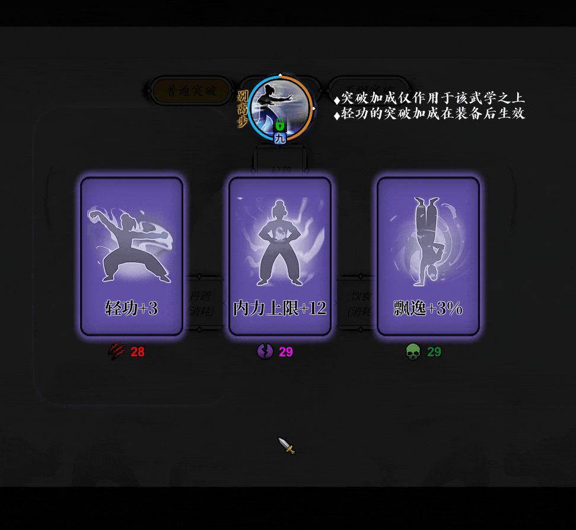

# 名扬天下 RisingFame

《龙吟立志传》BepInEx 插件  
聚焦稳定、低负担、真入账的核心增强

[下载发布版](https://github.com/Cooper-X-Oak/LongYinMod_RisingFame/releases/latest) | [更新记录](./CHANGELOG.md) | [贡献说明](./CONTRIBUTING.md) | [问题反馈](https://github.com/Cooper-X-Oak/LongYinMod_RisingFame/issues/new/choose)

  <strong>真入账倍率</strong> · <strong>低风险刷新</strong> · <strong>轻量稳定</strong>

  <a href="#quick-start">安装</a> ·
  <a href="#why-install">卖点</a> ·
  <a href="#refresh-feature">刷新</a> ·
  <a href="#support-boundary">边界</a> ·
  <a href="#troubleshooting">排障</a> ·
  <a href="#deep-docs">文档</a>

> [!IMPORTANT]
> 这不是一个“大而全”的功能包。  
> 它更像一套轻量增强：优先保证能进游戏、能真的生效、也能随时关掉。  
> 如果你在意的是稳定、低负担、少折腾，这个版本就是朝这个方向做的。

## [01] 快速开始

1. 从 [Releases](https://github.com/Cooper-X-Oak/LongYinMod_RisingFame/releases/latest) 下载当前版本的 `RisingFame.dll`。
2. 下载并解压固定版本 `BepInEx-Unity.IL2CPP-win-x64-6.0.0-be.755+3fab71a.zip`。
3. 解压到 `LongYinLiZhiZhuan.exe` 所在目录。
4. 先不要放其他 mod，手动启动一次游戏，确认已生成 `BepInEx/LogOutput.log`。
5. 将 `RisingFame.dll` 放入 `BepInEx/plugins/`。
6. 再次启动游戏，进游戏后按 `=` 测试开关。

> [!NOTE]
> 如果只装固定版本的 BepInEx 就已经打不开游戏，先不要继续加本插件。  
> 这种情况通常是 BepInEx 环境问题，不是 `RisingFame.dll` 本身。

---

## [02] 为什么值得装

- **真入账倍率**：优先挂在更靠后的实际入账点，避免“面板变了，最后没进账”。
- **低风险刷新**：`Alt+R` 只作用于当前已经打开的目标界面，尽量走原生控制器入口。
- **随时可关**：`=` 即时切换 `ON / OFF`，只有蜂鸣和短日志，不打断正常流程。
- **成长反馈更明显**：与主角走同一入账路径的 NPC，武学和技艺经验倍率也会生效。

---

## [03] 1.8 新功能：一键刷新

`1.8` 版本加入 `Alt+R` 上下文一键刷新。  
目的很直接：少走那些反复退出、重进、重开的流程，同时尽量不把兼容风险再抬高。

当前支持：

- 突破词条
- 神兵 / 特殊强化词条
- 拍卖重开

演示：

- 技术说明：[doc/refresh-implementation-notes.md](./doc/refresh-implementation-notes.md)

---

<strong>[04] 具体倍率规则</strong> - 展开查看当前版本的完整倍率与开关规则

 

- `=`：切换 `ON / OFF`，带蜂鸣和简短日志。
- **武学经验**：起始 `x3.0`，每升 1 阶 `+0.5`，公式 `max(1.0, 3.0 + 0.5 * heroForceLv)`。
- **技艺经验**：起始 `x2.0`，每升 1 阶 `+0.5`，公式 `max(1.0, 2.0 + 0.5 * heroForceLv)`。
- **好感增长**：起始 `x1.5`，每升 1 阶 `+0.5`，仅放大正向变化，公式 `max(1.0, 1.5 + 0.5 * heroForceLv)`。
- **门派 & 官府功绩**：外门派与官府为 `(heroForceLv + 1) + fame / 1000`；本门派为 `((heroForceLv + 1) + fame / 1000) * 0.5`。
- **抄书**：进度 `x10`，花费 `/10`，时间 `/10`。

---

## [05] 支持边界

- 系统：`Windows x64`
- 游戏：`Steam 版《龙吟立志传》`
- 运行时：`Unity IL2CPP`
- BepInEx：`6.0.0-be.755+3fab71a`
- 安装顺序：先单独验证 `BepInEx` 能正常启动，再放入 `RisingFame.dll`
- 排障原则：不要一上来就和其他 mod 混装测试

> [!WARNING]
> 超出以上组合的环境、版本和混装方式，不在当前支持范围内。  
> 这个仓库会把支持边界写死、说清楚，而不是承诺“理论兼容一切”。

---

## [06] 遇到问题先看这里

### [06.1] 只装 BepInEx 就打不开

先不要放 `RisingFame.dll`。  
如果只装固定版本的 BepInEx 仍然打不开，问题通常在 BepInEx 环境本身：版本错误、架构错误，或者目录里混有旧文件。

### [06.2] 放入 DLL 后不生效或进不去

先确认 `BepInEx/LogOutput.log` 里有插件加载信息，并确保 `BepInEx/plugins/` 里只有当前版本的 `RisingFame.dll`。  
排障时不要先混装其他 mod。

### [06.3] 反馈问题时带上这些

1. `BepInEx/LogOutput.log`
2. 游戏根目录截图
3. 你下载的 `BepInEx` 压缩包完整文件名

---

## [07] 研究与实现文档

首页只保留最核心的信息。  
如果你想继续看需求、逆向、实现路径，可以从下面按主题展开。

<strong>[07.1] 需求侧</strong> - 玩家到底要什么

 

<pre>
[07.1] 需求侧
├─ [07.1.1] 社区需求与功能提案
│  ├─ 需求归类
│  ├─ 提案优先级
│  ├─ P0 细化定义
│  └─ 落地顺序
└─ [07.1.2] Bilibili 需求二次分析
   ├─ 重点样本
   ├─ 二次结论
   ├─ 路线启发
   └─ 后续研究方向
</pre>

- 主文档：[社区需求与功能提案](./doc/mod-demand-proposals.md)、[Bilibili 需求二次分析](./doc/bilibili-demand-analysis.md)
- 直达章节：[需求归类](./doc/mod-demand-proposals.md#demand-categories) / [提案优先级](./doc/mod-demand-proposals.md#demand-priority) / [P0 细化定义](./doc/mod-demand-proposals.md#demand-p0-scope) / [落地顺序](./doc/mod-demand-proposals.md#demand-roadmap)
- 直达章节：[重点样本](./doc/bilibili-demand-analysis.md#bili-analysis-samples) / [二次结论](./doc/bilibili-demand-analysis.md#bili-analysis-conclusion) / [路线启发](./doc/bilibili-demand-analysis.md#bili-analysis-insights) / [后续研究方向](./doc/bilibili-demand-analysis.md#bili-analysis-next)

<strong>[07.2] 技术侧</strong> - 原生流程与稳定挂点

 

<pre>
[07.2] 技术侧
├─ [07.2.1] 原生 Hook / 管线研究
│  ├─ 稳定核心挂点
│  ├─ 武学经验管线
│  ├─ 原生通知管线
│  └─ 挂点建议
└─ [07.2.2] P0 低风险减肝 / 交互提效包研究
   ├─ 目标拆分
   ├─ 读书流程研究
   ├─ 原生提示管线
   └─ 实现优先级建议
</pre>

- 主文档：[原生 Hook / 管线研究](./doc/native-hook-research.md)、[P0 低风险减肝 / 交互提效包研究](./doc/p0-qol-pipe-research.md)
- 直达章节：[稳定核心挂点](./doc/native-hook-research.md#native-core-hooks) / [武学经验管线](./doc/native-hook-research.md#native-fight-pipeline) / [原生通知管线](./doc/native-hook-research.md#native-notify-pipeline) / [挂点建议](./doc/native-hook-research.md#native-hook-suggestions)
- 直达章节：[目标拆分](./doc/p0-qol-pipe-research.md#p0-target-split) / [读书流程研究](./doc/p0-qol-pipe-research.md#p0-read-book) / [原生提示管线](./doc/p0-qol-pipe-research.md#p0-native-feedback) / [实现优先级建议](./doc/p0-qol-pipe-research.md#p0-priority)

<strong>[07.3] 实现侧</strong> - 已落地功能是怎么跑通的

 

<pre>
[07.3] 实现侧
└─ [07.3.1] 一键刷新功能逆向与实现说明
   ├─ 初版失败现象
   ├─ 原生控制器入口
   ├─ 最终实现路径
   └─ 未来启发
</pre>

- 主文档：[一键刷新功能逆向与实现说明](./doc/refresh-implementation-notes.md)
- 直达章节：[初版失败现象](./doc/refresh-implementation-notes.md#refresh-first-failure) / [原生控制器入口](./doc/refresh-implementation-notes.md#refresh-native-controllers) / [最终实现路径](./doc/refresh-implementation-notes.md#refresh-final-path) / [未来启发](./doc/refresh-implementation-notes.md#refresh-future)

<strong>[07.4] 资料层</strong> - 原始抓取样本与素材

 

<pre>
[07.4] 资料层
└─ Bilibili 原始抓取资料包
</pre>

- 主文档：[Bilibili 原始抓取资料包](./doc/bilibili/README.md)

## License

MIT
